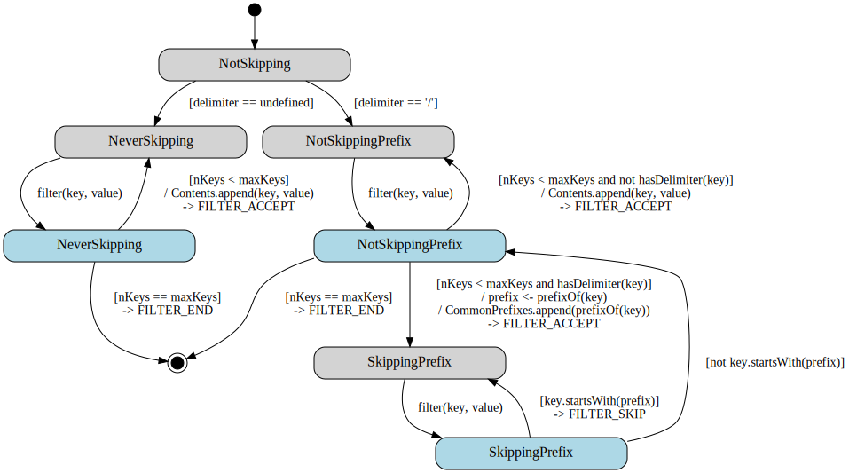

# Delimiter

The Delimiter class handles raw listings from the database with an
optional delimiter, and fills in a curated listing with "Contents" and
"CommonPrefixes" as a result.

## Expected Behavior

- only lists keys belonging to the given **prefix** (if provided)

- groups listed keys that have a common prefix ending with a delimiter
  inside CommonPrefixes

- can take a **marker** or **continuationToken** to list from a specific key

- can take a **maxKeys** parameter to limit how many keys can be returned

## State Chart

- States with grey background are *Idle* states, which are waiting for
  a new listing key

- States with blue background are *Processing* states, which are
  actively processing a new listing key passed by the filter()
  function

