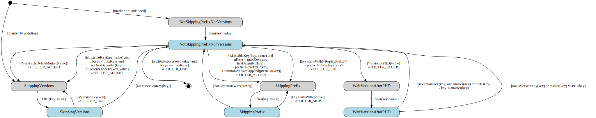

# DelimiterMaster

The DelimiterMaster class handles raw listings from the database of a
versioned or non-versioned bucket with an optional delimiter, and
fills in a curated listing with "Contents" and "CommonPrefixes" as a
result.

## Expected Behavior

- only lists latest versions of versioned buckets

- only lists keys belonging to the given **prefix** (if provided)

- does not list latest versions that are delete markers

- groups listed keys that have a common prefix ending with a delimiter
  inside CommonPrefixes

- can take a **marker** or **continuationToken** to list from a specific key

- can take a **maxKeys** parameter to limit how many keys can be returned

- reconciles internal PHD keys with the next version (those are
  created when a specific version that is the latest version is
  deleted)

- skips internal keys like replay keys

## State Chart

- States with grey background are *Idle* states, which are waiting for
  a new listing key

- States with blue background are *Processing* states, which are
  actively processing a new listing key passed by the filter()
  function

### Bucket Vformat=v0

### Bucket Vformat=v1

For buckets in versioning key format **v1**, the algorithm used is the
one from [Delimiter](delimiter.md).
