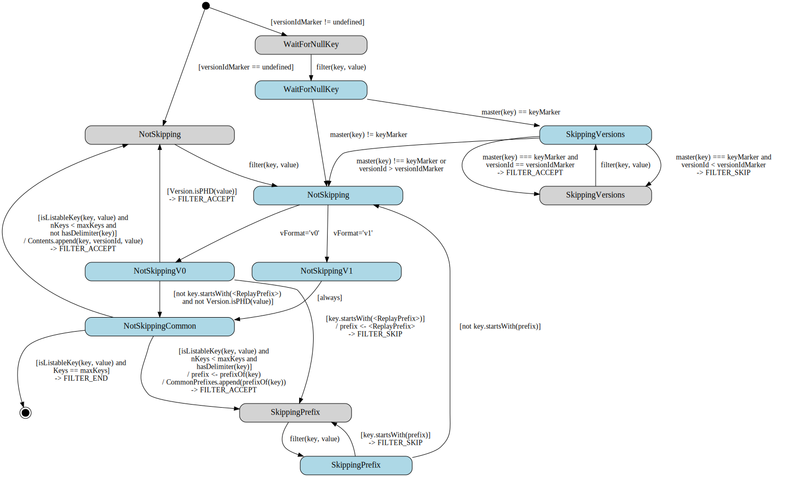

# DelimiterVersions

The DelimiterVersions class handles raw listings from the database of a
versioned or non-versioned bucket with an optional delimiter, and
fills in a curated listing with "Versions" and "CommonPrefixes" as a
result.

## Expected Behavior

- lists individual distinct versions of versioned buckets

- only lists keys belonging to the given **prefix** (if provided)

- groups listed keys that have a common prefix ending with a delimiter
  inside CommonPrefixes

- can take a **keyMarker** and optionally a **versionIdMarker** to
  list from a specific key or version

- can take a **maxKeys** parameter to limit how many keys can be returned

- skips internal keys like replay keys

## State Chart

- States with grey background are *Idle* states, which are waiting for
  a new listing key

- States with blue background are *Processing* states, which are
  actively processing a new listing key passed by the filter()
  function

